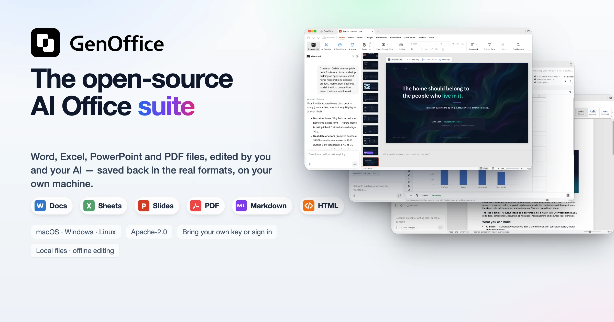
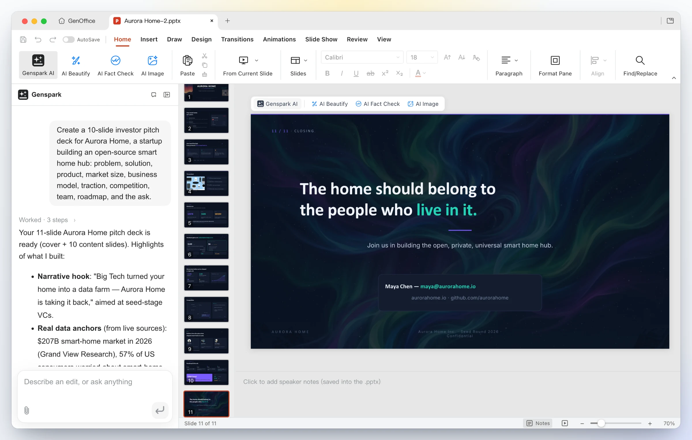
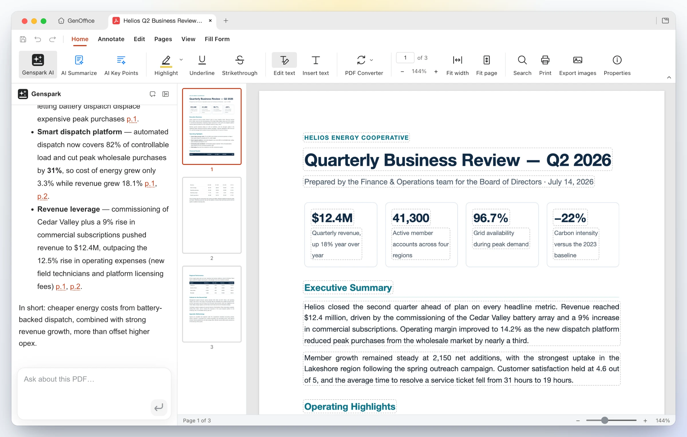
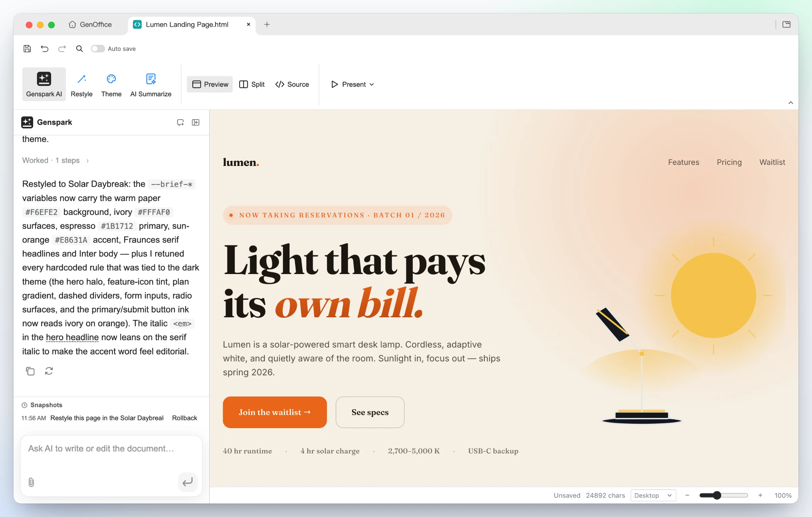
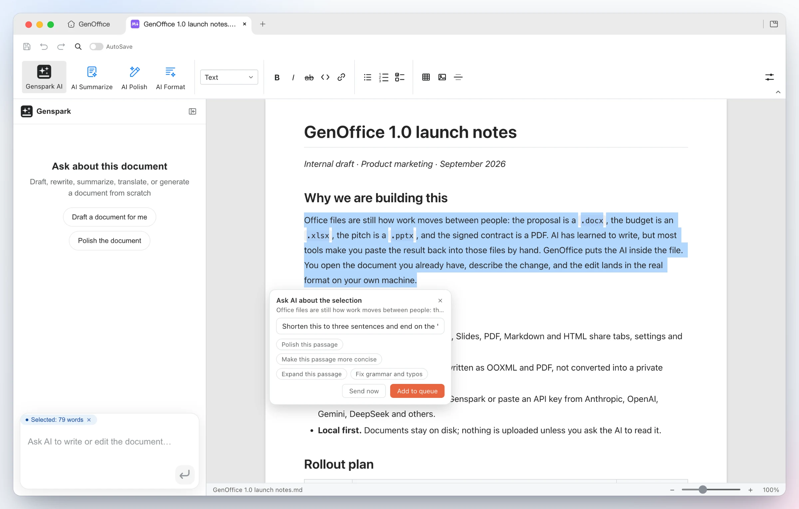
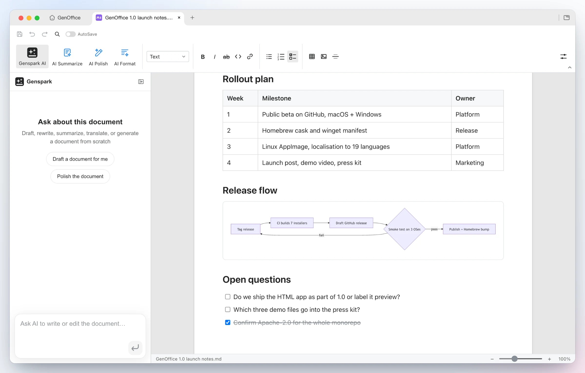

<p align="center">
  <a href="https://genoffice.ai/">
    <picture>
      <source srcset="../assets/readme/hero-dark.webp" media="(prefers-color-scheme: dark)">
      
    </picture>
  </a>
</p>

<h1 align="center">GenOffice</h1>

<p align="center"><b>全球首款功能完整的开源 AI 办公套件。</b><br>
Word、Excel、PowerPoint 和 PDF 文件，由你与你的 AI 共同编辑，并以原生格式保存。</p>

<p align="center">
  <a href="../../LICENSE"></a>
  <a href="https://github.com/genspark-ai/genoffice/releases/latest"></a>
  <a href="https://github.com/genspark-ai/genoffice/releases"></a>
  <a href="https://github.com/genspark-ai/genoffice/stargazers"></a>
</p>

<p align="center"><a href="../../README.md">English</a> · <a href="README.es.md">Español</a> · <a href="README.pt-BR.md">Português (Brasil)</a> · <a href="README.de.md">Deutsch</a> · <a href="README.fr.md">Français</a> · <b>简体中文</b> · <a href="README.zh-TW.md">繁體中文</a> · <a href="README.ko.md">한국어</a> · <a href="README.ja.md">日本語</a> · <a href="README.ar.md">العربية</a> · <a href="README.ru.md">Русский</a> · <a href="README.it.md">Italiano</a> · <a href="README.nl.md">Nederlands</a> · <a href="README.pl.md">Polski</a> · <a href="README.cs.md">Čeština</a> · <a href="README.id.md">Bahasa Indonesia</a> · <a href="README.ms.md">Bahasa Melayu</a> · <a href="README.th.md">ไทย</a> · <a href="README.hi.md">हिन्दी</a> · <a href="README.he.md">עברית</a></p>

<p align="center">
  <a href="#download"><b>下载</b></a> ·
  <a href="https://genoffice.ai/"><b>官网</b></a> ·
  <a href="https://genoffice.ai/join"><b>社区</b></a> ·
  <a href="../../PRIVACY.md"><b>隐私</b></a>
</p>

GenOffice 是一款免费、开源的 Microsoft Office 替代品，支持 macOS、Windows
和 Linux。它可以直接打开并保存原生 `.docx`、`.xlsx` 和 `.pptx` 文件，编辑
PDF、Markdown 和 HTML，并在每份文档旁边配备一个 AI 智能体 —— 不是在侧边硬
塞一个聊天框，而是一个真正会读取文件、执行修改，并清楚展示改动之处的编辑器。

- **原生格式，字节级保留。** 只有你编辑过的部分才会被重写，文件中的其他内容
  全部逐字节保留，文档在 Word、Excel 和 PowerPoint 中照常可用。
- **可审阅的 AI。** 修改以修订痕迹和差异对比的形式呈现，一键即可回滚。表格
  得到的是实时公式，而不是粘贴进来的数字；幻灯片和网页直接生成到画布上，
  仍然可以随意编辑。
- **本地优先的设计。** 文件的打开、编辑、保存和转换都在你的电脑上完成。
  PDF → Word / Excel / PowerPoint、Markdown → Word、HTML → Word 全部在本机运行。
  只有 AI 调用会发送到你选择的服务商。
- **用自己的密钥，或者不用密钥。** 登录 Genspark 即可免配置使用；也可以自带
  Claude、OpenAI、Gemini、DeepSeek、Kimi、GLM、Qwen、Doubao、MiniMax、Grok、
  Mistral、OpenRouter、API Route、Requesty 的密钥，或任何 OpenAI 兼容端点，包括本地模型服务。

**获取：** [macOS](https://github.com/genspark-ai/genoffice/releases/latest)（Apple Silicon 和 Intel）·
[Windows](https://github.com/genspark-ai/genoffice/releases/latest)（x64 和 Arm）·
[Linux](https://github.com/genspark-ai/genoffice/releases/latest)（deb、rpm、AppImage）——
详情与系统要求见[下载](#download)。

## 演示

六个应用，一个 AI 面板。每张截图都是 macOS 上的真实应用，AI 的操作均由面板中
可见的提示词驱动。

### 1 · Docs —— 打开并编辑 `.docx`，AI 改动可审阅

<table>
<tr>
<td width="50%"></td>
<td width="50%"></td>
</tr>
<tr>
<td><b>按 Word 的排版方式打开文件</b> —— 双栏章节、出血图片、底纹表格、页眉页脚，并按 Word 的行度量分页。样式、批注、修订、公式和墨迹原样往返，不受影响。</td>
<td><b>说出你想要的修改</b> —— AI 读取所需的内容块，重写「概述」并插入一个新的项目符号章节。每一轮 AI 操作都是一个可回滚的快照；开启<b>修订</b>后，改动会以 Word 风格的修订形式呈现。</td>
</tr>
</table>

### 2 · Sheets —— `.xlsx` 中的实时公式与图表，而不是粘贴的数字

<table>
<tr>
<td width="50%"></td>
<td width="50%"></td>
</tr>
<tr>
<td><b>让它来做</b> —— 只需一句话，智能体就会新增一张「汇总」工作表，按地区和类别写入真正的 <code>SUMIF</code> 公式，插入柱状图，并把这 43 项更改作为一个可撤销的批次一次应用。</td>
<td><b>向它提问</b> —— 关于工作簿的问题会连同推理过程一起返回，所用的具体单元格以可点击的引用形式给出。底层是自研的 Rust <code>.xlsx</code> 引擎，支持数据透视表、切片器、条件格式和公式追踪。</td>
</tr>
</table>

### 3 · Slides —— 从一句提示词到一份 `.pptx` 演示文稿


<table>
<tr>
<td width="50%"></td>
<td width="50%"></td>
</tr>
<tr>
<td><b>输入一句话</b> —— “为 Aurora Home 制作一份 10 页的投资人融资演示文稿……”。GenOffice 规划故事线、调研数据，并把每一页直接生成到画布上，成为真正的 <code>.pptx</code>。</td>
<td><b>产出一份完整的演示文稿</b> —— 十一页经过设计的幻灯片，字体、配图风格统一，并以行动号召收尾；可以继续用母版、版式、智能参考线和无损裁剪编辑，也可以让面板重新设计风格、改写文字或调整顺序。</td>
</tr>
</table>

### 4 · PDF —— 原位编辑 PDF 文字，本机将 PDF 转为 Word

<table>
<tr>
<td width="50%"></td>
<td width="50%"></td>
</tr>
<tr>
<td><b>在页面内直接编辑</b> —— 「编辑文字」模式为每个文本块勾勒边框，可原位重新输入；内容流通过 PDFium 用原始字体重写，而不是用注释遮盖。就一份长报告向 AI 提问，可以得到带页码引用的回答。</td>
<td><b>本机转换</b> —— <b>PDF 转换器 → PDF 转 Word</b> 生成可编辑的 <code>.docx</code>，在 Docs 中于源文件旁边打开，标题、数据行和段落都完整保留。转换为 Excel 和 PowerPoint 的方式相同；扫描页会经由系统 OCR 处理。</td>
</tr>
</table>

### 5 · HTML —— 先出设计简报的 AI 网页与 UI 构建器

说明这个页面的用途和受众。AI 会先提出一份**设计简报** —— 主视觉钩子、配色、
字体和风格方向 —— 然后依据这些设计令牌构建一个单文件、自包含的 `.html`。


<table>
<tr>
<td width="50%"></td>
<td width="50%"></td>
</tr>
<tr>
<td><b>一句提示词生成</b> —— 为 Lumen 生成的醒目主视觉、功能卡片、定价和候补名单表单，采用 Midnight Studio 风格方向。点击任意元素即可重新设计样式，双击编辑文字，或切换到 CodeMirror 源码视图。</td>
<td><b>同一设计，全新方向</b> —— 一次<b>重新设计风格</b>请求即可替换简报中的设计令牌，页面随之变化：暖色纸张、编辑风衬线体、日出橙强调色，文字一字未改。可全屏演示，也可导出为 PDF 或原生可编辑的 Word 文档。</td>
</tr>
</table>
<table>
<tr>
<td width="50%"></td>
<td width="50%"></td>
</tr>
<tr>
<td><b>UI 原型</b> —— 「个人工作台」起手式把一个用户画像变成可用的布局：左侧导航栏、问候语、计费工时迷你图、发票和利用率卡片，全部是可以直接交给开发者的真实 HTML。</td>
<td><b>数据故事</b> —— 「数据报告」起手式构建一份编辑风格的大报版面：衬线体报头、一个头条数字、以分隔线区分的统计行、内联 SVG 图表和方法论说明。</td>
</tr>
</table>

### 6 · Markdown —— 基于纯 `.md` 的块编辑器，带 Ask AI

<table>
<tr>
<td width="50%"></td>
<td width="50%"></td>
</tr>
<tr>
<td><b>就选中内容询问 AI</b> —— 选中任意段落，就会出现 <b>Ask AI</b> 芯片：输入指令或选择建议，立即发送，或者把多处锚定的修改加入队列后一次执行。每个应用都有同样的入口。</td>
<td><b>所见即渲染，保存为纯 Markdown</b> —— 标题、列表、表格、图片、代码块和 Mermaid 图表都在 Tiptap 块编辑器中呈现，写回时仍是纯 <code>.md</code>，并支持完全本地的 <b>Markdown → Word</b> 导出。</td>
</tr>
</table>

## 为什么选择 GenOffice

- **开源**，Apache-2.0 协议，在 GitHub 上公开开发。
- **由你掌控。** macOS、Windows 和 Linux 原生应用；文件留在本地磁盘，每一次编辑、
  保存和转换都在你的机器上完成。
- **真正的 Office 文件。** 原生 `.docx`、`.xlsx` 和 `.pptx`，字节级保留：未改动
  的部分原样复制。
- **直接编辑文档的 AI。** Docs 中的修订痕迹、Sheets 中实时生效的公式和图表、直接
  在画布上生成的幻灯片，每一次 AI 操作都会留下可回滚的快照。
- **自带模型，自带密钥。** 使用 Genspark 登录，或带上 Claude、OpenAI、Gemini、
  DeepSeek 等的密钥，同样支持本地服务器和任意 OpenAI 兼容端点。
- **认真做好 PDF。** 在页面内直接编辑文字，本机将 PDF 转换为 Word、Excel 或
  PowerPoint，扫描件支持系统 OCR。
- **同样支持 Markdown 和 HTML**，共用同一个 AI 面板，并可本机导出为 Word。
- **免费**，个人和团队皆可使用。

## AI 后端

**登录 Genspark**，无需任何配置：模型调用通过 Genspark 代理路由（Claude、GPT
和 Gemini 系列），智能体同时获得网页与图片搜索、图片生成，以及图片/音频/视频
解析能力。

**或者自带密钥。** 设置 → AI 中列出了 Claude、OpenAI、Gemini、DeepSeek、Kimi、
GLM、Qwen、Doubao、MiniMax、Grok、Mistral、OpenRouter、API Route、Requesty 和 OpenCode Zen/Go，另有
一个自定义槽位可接入任何 OpenAI 兼容端点（Base URL + 密钥），包括本地模型服务。
搜索和媒体能力在 **AI 媒体与搜索** 下按能力分别配置服务商：网页搜索可选 Serper
或 Tavily；图片生成和图片/视频解析可选 OpenAI、Gemini、Doubao/Seedream、GLM、
Grok、Qwen、MiniMax 或任何 OpenAI 兼容的图片端点。

整个套件提供浅色、深色和跟随系统三种主题。主题只改变屏幕上的显示：导出、打印
和保存的文件始终保留文档自身的颜色。

<a id="download"></a>

## 下载

| 平台                                  | 系统要求                                               | 下载                                                                                   |
| ------------------------------------- | ------------------------------------------------------ | -------------------------------------------------------------------------------------- |
| **macOS** —— Apple Silicon (arm64)    | macOS 11+                                              | [最新 `.dmg`（arm64）](https://github.com/genspark-ai/genoffice/releases/latest)       |
| **macOS** —— Intel (x64)              | macOS 11+                                              | [最新 `.dmg`（x64）](https://github.com/genspark-ai/genoffice/releases/latest)         |
| **Windows**（x64，大多数 PC）         | Windows 10+，Intel/AMD                                 | [最新 `-x64.exe` 安装程序](https://github.com/genspark-ai/genoffice/releases/latest)   |
| **Windows** on Arm（ARM64）           | Windows 11 on Arm（Snapdragon X 及同类芯片）           | [最新 `-arm64.exe` 安装程序](https://github.com/genspark-ai/genoffice/releases/latest) |
| **Linux** —— Debian / Ubuntu          | x86_64，glibc 2.34+（Ubuntu 22.04 或更新）             | [最新 `.deb`](https://github.com/genspark-ai/genoffice/releases/latest)                |
| **Linux** —— Fedora / RHEL / openSUSE | x86_64，glibc 2.34+（Fedora 35+、RHEL 9+、Leap 15.6+） | [最新 `.rpm`](https://github.com/genspark-ai/genoffice/releases/latest)                |
| **Linux** —— 其他发行版               | x86_64，glibc 2.34+，FUSE 2                            | [最新 `.AppImage`](https://github.com/genspark-ai/genoffice/releases/latest)           |

所有构建均来自 `main` 分支；macOS 和 Windows 安装程序均已签名。
历史版本见 [Releases](https://github.com/genspark-ai/genoffice/releases) 页面。

<details>
<summary><b>在 Linux 上安装</b></summary>

deb 包通过 apt 安装 —— 会自动拉取依赖并把 GenOffice 添加到应用程序菜单：

```bash
sudo apt install ./genoffice_<version>_amd64.deb
```

在 Fedora / RHEL 系 / openSUSE 上，请改用 rpm 包：

```bash
sudo dnf install ./genoffice-<version>.x86_64.rpm     # Fedora / RHEL family
sudo zypper install ./genoffice-<version>.x86_64.rpm  # openSUSE
```

AppImage 无需安装即可运行：先安装 FUSE 2 运行时
（`sudo apt install libfuse2`；在 Ubuntu 24.04 上软件包名为 `libfuse2t64`），
给文件加上可执行权限，然后运行：

```bash
chmod +x GenOffice-<version>.AppImage
./GenOffice-<version>.AppImage
```

</details>

## 工作原理

七个 Electron 应用 —— Docs、Sheets、Slides、PDF、Markdown、HTML 以及多标签
外壳 —— 共享同一层由纯 TypeScript 包组成的引擎，外加一个处理 `.xlsx` 的 Rust
sidecar。原始文件始终是唯一事实来源：修改以窄范围补丁的形式应用，编辑器未触
碰的一切在往返过程中原样保留。

```
open docx ─► archive original by hash (never touched)
          ─► parse word/document.xml into a block tree, each block anchored to its original XML
          ─► Tiptap editor (manual + AI editing, dirty tracking)
save      ─► dirty blocks → OOXML fragments (referencing existing styles only)
          ─► splice into the original document.xml; untouched blocks keep their bytes
          ─► repack the zip; every other entry is copied byte-for-byte
```

逐个包的导览（docx/pptx 引擎、`pdf2docx`、`html2docx`、智能体核心与服务商）
见 [CONTRIBUTING.md](../../CONTRIBUTING.md#engine-packages)。

## 开发

```bash
npm install
npm run fixtures     # generate test .docx fixtures
npm test             # engine + app unit tests (docs/sheets/slides need no display)
npm run typecheck    # tsc --noEmit across every workspace
npm run dev          # all six editors + shell against Vite dev servers
npm run dev:docs     # a single app (same pattern works per workspace)
npm run dist:mac     # package macOS dmg (regenerates third-party notices)
npm run dist:win     # package Windows nsis installer
npm run dist:linux   # package Linux AppImage + deb + rpm
```

Sheets 应用的 xlsx sidecar 还需要 Rust 工具链（`cargo` 在 PATH 中）；
`npm run build -w @genoffice/sheets` 会自动编译它。每项改动必须通过的检查以及
拉取请求的合入流程见 [CONTRIBUTING.md](../../CONTRIBUTING.md)。

## 社区

GenOffice 正在积极开发中，你的反馈决定它的走向。

- **报告 bug 或提出功能需求**，请到
  [GitHub Issues](https://github.com/genspark-ai/genoffice/issues)。
- **加入 GenOffice 群聊**，在
  [GenTeam](https://genoffice.ai/join) 上与团队和其他用户交流。
- **给仓库点个 Star** —— 如果 GenOffice 对你有用，这是支持项目最好的方式。

## 常见问题

<details>
<summary><b>GenOffice 是免费的吗？</b></summary>

是的。GenOffice 免费且开源，采用 Apache-2.0 许可证 —— 没有试用期，应用本身也
没有付费档。

</details>

<details>
<summary><b>GenOffice 能打开 Microsoft Word、Excel 和 PowerPoint 文件吗？</b></summary>

可以。GenOffice 直接打开并保存原生 `.docx`、`.xlsx` 和 `.pptx` 文件。保存是
字节级保留的：你未改动的部分会逐字节写回，文档在 Microsoft Office 中照常可用。

</details>

<details>
<summary><b>GenOffice 可以离线使用吗？</b></summary>

文档编辑完全在本地进行 —— 打开、编辑、保存和转换文件都不需要把文件发送到任何
地方。AI 功能（智能体、搜索、图片工具）需要网络连接，并且需要登录 Genspark 或
提供你自己的模型 API 密钥。

</details>

<details>
<summary><b>GenOffice 能编辑 PDF 文件吗？</b></summary>

可以 —— 真正的 PDF 文字和图片编辑，会在保留原始字体的前提下重写页面内容流，
而不是用注释遮盖。

</details>

<details>
<summary><b>GenOffice 能把 PDF 转换为 Word、Excel 或 PowerPoint 吗？</b></summary>

可以 —— 完全在本机完成：PDFium 字符级提取加上基于几何的版面分析，不依赖云
服务，不上传。扫描页同样支持：在 macOS 和 Windows 上由系统 OCR 识别，转换结果
是可编辑的文字，而不是一张页面图片。

</details>

<details>
<summary><b>我可以使用自己的 AI 模型或 API 密钥吗？</b></summary>

可以。除了免密钥的 Genspark 登录，GenOffice 还支持自带 Claude、OpenAI、Gemini、
DeepSeek、Kimi、GLM、Qwen、Doubao、MiniMax、Grok、Mistral、OpenRouter、API Route、Requesty 和
OpenCode Zen/Go 的密钥，以及任何 OpenAI 兼容端点 —— 包括本地模型服务。搜索、
图片生成和图片/视频解析在 设置 → AI 媒体与搜索 下使用各自的密钥。

</details>

<details>
<summary><b>GenOffice 能把 HTML 转换为 Word 吗？</b></summary>

可以 —— HTML 应用中的「导出为 Word」会完全在本机生成原生、可编辑的 `.docx`。
页面先在内置 Chromium 中渲染，再归约为真正的 Word 结构：标题、段落、列表、
表格、卡片、KPI 行、表单字段和页面背景；只有在 Word 中没有对应结构的视觉元素
（图表、图标、装饰性方框）才会以图片形式嵌入。

</details>

<details>
<summary><b>GenOffice 会收集数据吗？</b></summary>

官方打包版本默认会发送有限的使用统计，你可以随时在 设置 → 通用 中关闭上报。
统计数据绝不包含文档内容、文件名、文件路径、账号身份或电子邮件地址。完整的事件
和数据披露见 [GenOffice 隐私政策](../../PRIVACY.md)。

</details>

## 安全

进程安全态势（渲染进程沙箱、IPC 校验、外部链接拦截）以及针对 AI 生成内容的
威胁模型，见 [SECURITY.md](../../SECURITY.md)。

## 致谢

没有以下开源项目，就不会有 GenOffice：

- [Electron](https://www.electronjs.org/) —— 每个应用的桌面运行时。
- [Univer](https://github.com/dream-num/univer)（Apache-2.0）—— Sheets 所扩展的
  电子表格 UI 内核。
- [PDFium](https://pdfium.googlesource.com/pdfium/)（BSD-3-Clause，经
  [@embedpdf/pdfium](https://github.com/embedpdf/embed-pdf-viewer) 打包）——
  真正的 PDF 文字与图片编辑背后的内容流引擎。
- [pdf.js](https://github.com/mozilla/pdf.js)（Apache-2.0）和
  [pdf-lib](https://github.com/Hopding/pdf-lib)（MIT）—— PDF 渲染与文档组装。
- [Tiptap](https://tiptap.dev/) / [ProseMirror](https://prosemirror.net/) ——
  Docs 和 Markdown 中的块编辑器。
- [CodeMirror](https://codemirror.net/)（MIT）—— HTML 中的源码编辑器。
- [Konva](https://konvajs.org/) —— Slides 以及 Sheets 图表的画布渲染。
- [HarfBuzz](https://github.com/harfbuzz/harfbuzz)（wasm）—— 复杂文字的
  文本整形度量。
- [calamine](https://github.com/tafia/calamine) 和
  [IronCalc](https://github.com/ironcalc/IronCalc) —— Rust xlsx sidecar 的
  读取层与计算层。
- [libeot](https://github.com/umanwizard/libeot)（MPL-2.0）—— 面向嵌入式
  PowerPoint 字体的 MicroType Express 解码器，已移植为 TypeScript。
- [React](https://react.dev/)（MIT）—— 各个应用的 UI 层。
- [Mermaid](https://mermaid.js.org/)（MIT）和 [KaTeX](https://katex.org/)
  （MIT）—— Markdown 与 Docs 中的图表与数学公式。
- [opentype.js](https://opentype.js.org/)（MIT）—— 用于度量信息解析与字形
  查找的字体解析库。
- [JSZip](https://stuk.github.io/jszip/)（MIT）和
  [fast-xml-parser](https://github.com/NaturalIntelligence/fast-xml-parser)
  （MIT）—— OOXML 容器与 XML 层。
- [Fluent UI System Icons](https://github.com/microsoft/fluentui-system-icons)
  （MIT）—— 各功能区所用的图标集。
- [electron-updater](https://www.electron.build/)（MIT）—— 应用内更新。
- Liberation、Carlito、Caladea 和 Noto CJK 字体（OFL/Apache-2.0）—— 随应用
  打包的文档字体。

`npm run notices` 会重新生成随应用打包的第三方许可证摘要
（`tools/gen-third-party-notices.mjs`）；所有运行时依赖均为
MIT/Apache-2.0/BSD-3-Clause/OFL 许可。

## 许可证

GenOffice 采用 [Apache License 2.0](../../LICENSE) 许可，仅有一处例外：`ee/`
目录为未来的企业模块预留，受 [GenOffice 企业许可证](../../ee/LICENSE) 约束。

GenOffice 和 Genspark 的名称与标识是 Mainfunc, Inc. 的商标。Apache-2.0 许可证
并不授予使用它们的权利（见第 6 节）；分叉项目请使用自己的品牌。
